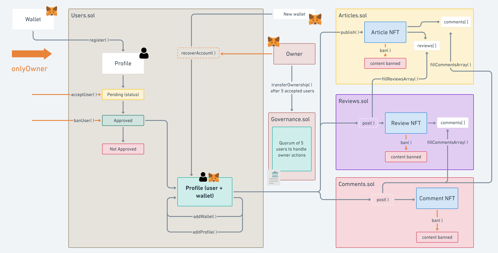

# Data architecture

## Architecture

Need owner auth functions


## TODO

- governance
- tags in bytes like ACCESS_CONTROL
- Array => mapping
- contracts for authentification (onlyUser)
- storage URI :
  - base modifiable (setBase) corresponding to the gateway
  - URI corresponding to classics metadata (image, name, ...) with the CID to the content
- Remove function to get nb of NFT (as in ERC721Enumerable we can have access to this)

### Version 0.0

```js
{
  "Users": {
    "rinkeby": { "address": "0xB53a11f8f9Dcb5379Dd3fE7AD1649727b18Ba491" }
  },
  "Articles": {
    "rinkeby": { "address": "0xc4D31789081B2EB0f1e65A3Cdf87AF17f1408817" }
  },
  "Reviews": {
    "rinkeby": { "address": "0xd17ffCa14121cbb08d8a671751b847287C31B4D1" }
  },
  "Comments": {
    "rinkeby": { "address": "0x175bAeF1584b9CBAc909111668ed769937443F81" }
  }
}
```

### Version 0.1 branch

- CID as string needed
- No token URI for the moment

```js
{
  "Users": {
    "rinkeby": { "address": "0x2DBc0235e6565c70f81Aa7F06BE51a57dad086B4" }
  },
  "Articles": {
    "rinkeby": { "address": "0xFA726c39CeB254F762C6b52CB9921f72aB0a20Dd" }
  },
  "Reviews": {
    "rinkeby": { "address": "0x7A2f775EAcA55FA6360618253CC8957Cd8501cD0" }
  },
  "Comments": {
    "rinkeby": { "address": "0x77943c71CF2d1da0E1678ac09581A5B149eA9454" }
  }
}
```

## Comment / Review [NFT]

- Author (address) = owner
- Date (timestamp) = TX
- title (maybe automatically generated)
- content => hashedContent (bytes)
- on [address(smart contract Article ou Review ou Comment) + id]
- replyTo (id)
- metrics (nb):
  - upVote
  - downVote

### Content metadata IPFS

- hashedContent (bytes)
- content (text)
- on article CID = QmRQWrE18iega4Ka89W6MorKYDaSR9WPLH1iL6ngERWwjP
- on paragraph CID (if possible, see IPLD) QmRQWrE18iega4Ka89W6MorKYDaSR9WPLH1iL6ngERWwjP/2

## Article [NFT]

- Author (address) = owner
- Date (timestamp) = TX
- title (string)
- Co author (address)
- content => hashedContent (bytes)
- nb paragraph  
  OR
- list of hashedParagraph
- metrics (nb):
  - need revision
  - reach standard
- add comment by modify the token (via function)

### use a ERC1155?

One article have multiple Review/Comment NFT

### Content metadata IPFS

- hashedContent (bytes)
- content (text)
- one CID for each paragraph?

## Centralized data (on IPFS maybe)

- WhiteList of wallets (those who can publish) (mapping of wallet made by an admin)

User register => User connect (token) => wallet (verification) => on whitelist (function via express)

Wallets linked to:

- author name
- bio (media, ...)
- email
- laboratory
- avatar
- metrics
- status (young - senior)

---

# Dapp architecture

## Pages

- Accueil
-
